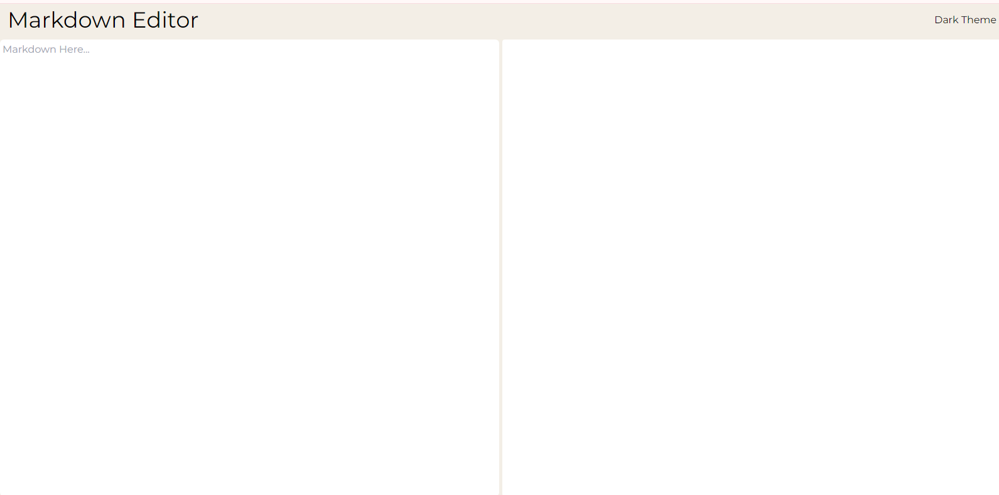

<h1 align="center">
Markdown Editor
</h1>

<h2>

[🚀Live Site]() || devjhex

</h2>

<!-- Badges -->

    

<!-- License -->

This is a web application that showcases the functionality of a simple markdown Editor. A user can simply type markdown in the markdown section and get readable output in real time.

<!-- Screenshots -->

## Technologies Used

- Vanilla JavaScript for application logic and event handling.
- Tailwind for styling of the markup.
- HTML for markup.

## Key Features

Users should be able to:
- View all the readable output immediately after typing a character or set of characters in markdown.
- **Bonus**: Dark mode toggler.

## Author

<b>👱🏿‍♂️ devjhex</b>

- Twitter - [@devJhex](https://www.twitter.com/devJhex)
- Frontend Mentor - [@devjhex](https://www.frontendmentor.io/profile/devjhex)
- Github: [@devjhex](https://github.com/devjhex)

Feel free to contact me with any questions or feedback!